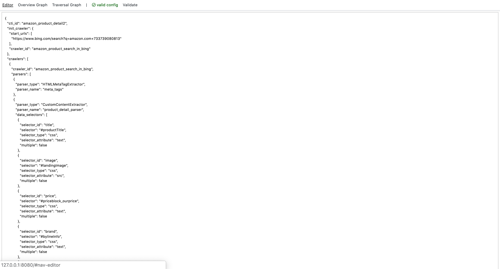
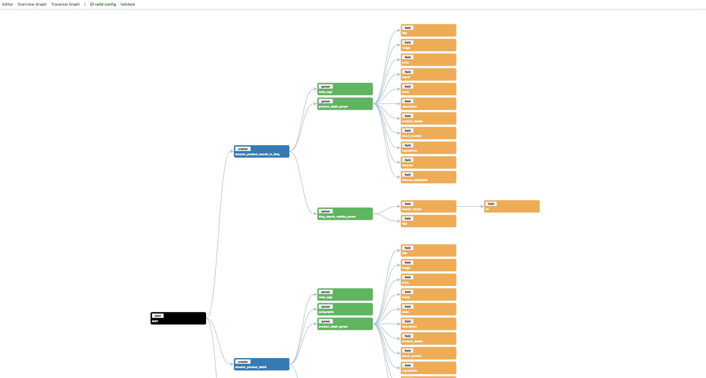
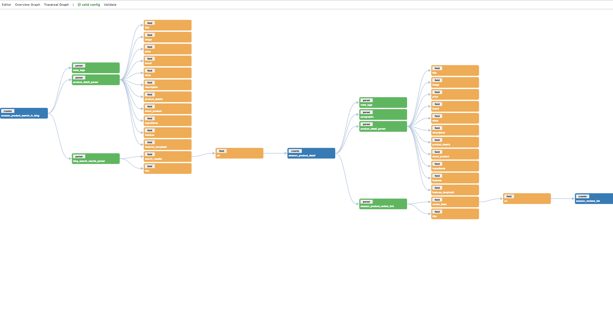

# Knowledge Flow Graph

A UI component to visualise the cti manifest used to run Crawl, Transform and Index flows with InvanaBot. 

## Screenshots

### Editor 

### Overview Graph

### traversal Graph
